# Procesverslag
**Auteur:** -Stijn Visser-

Markdown cheat cheet: [Hulp bij het schrijven van Markdown](https://github.com/adam-p/markdown-here/wiki/Markdown-Cheatsheet). Nb. de standaardstructuur en de spartaanse opmaak zijn helemaal prima. Het gaat om de inhoud van je procesverslag. Besteedt de tijd voor pracht en praal aan je website.

## Bronnenlijst
1. -Icons : Bron: www.flaticon.com-
2. -Shopping cart: Bron: https://www.youtube.com/watch?v=B20Getj_Zk4-
3. -Afbeelding/content : Bron: https://www.nike.com/nl/nl/cart-
4. -Side nav : Bron: www.w3school.com 
5. -Sticky nav : Bron: https://www.youtube.com/watch?v=LB70WzwBCTo

## Eindgesprek (week 7/8)

De stof die werd gegeven heb ik goed opgepakt en ik snapte al snel hoe alles werkte.
Hierdoor heb ik vrij snel en eenvoudig een goed werkende html code neergezet. 

Toen de html eenmaal netjes er uitzag ging ik verder met de opmaak van mijn site.
In het begin ging dit nog wat stroef en lukte dit niet helemaal, maar door veel te doen, tutorials te kijken en door veel te vragen aan de docent en student assistent is het allemaal goed gekomen.

Mijn site is bijna helemaal responsive. Daarnaast heb ik ook een shopping cart functie in mijn site verwerkt. In eerste instantie wou ik de shopping cart helemaal werkend maken, zodat ie net zoals een standaart shopping cart zou werken. Daarvoor moest ik alleen een local storage aanmaken, alleen koste dit zoveel tijd dat dit helaas niet meer is gelukt. De functie is wel deels werkend.
Ook wilde ik een micro animatie aan de shopping cart toevoegen, alleen is dit mij helaas ook niet gelukt.

Ik heb ook een side navigation en een sticky navigation in mijn site verwerkt. Door verschillende tutorials te kijken is mij dit gelukt.

**Screenshot(s):**

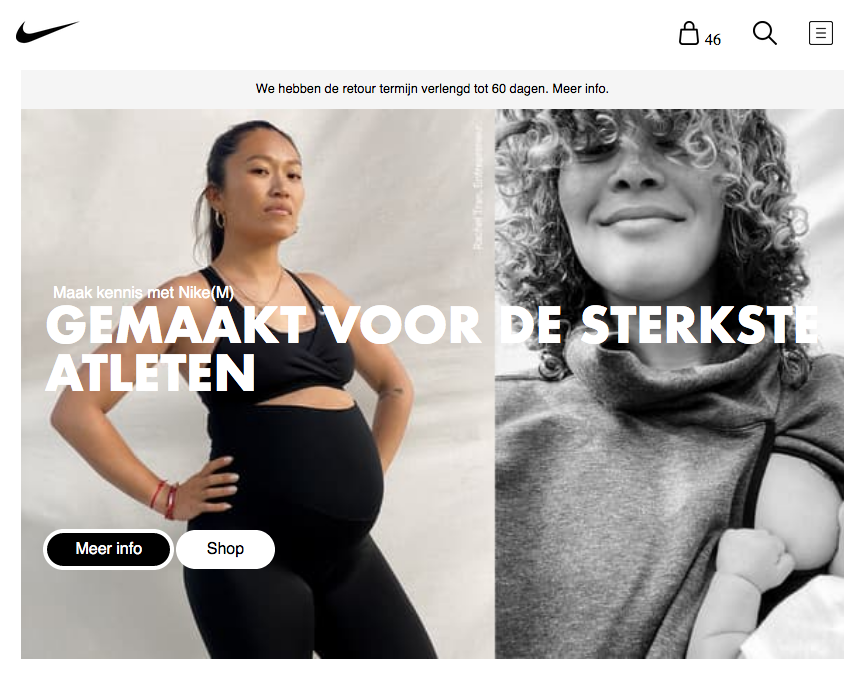
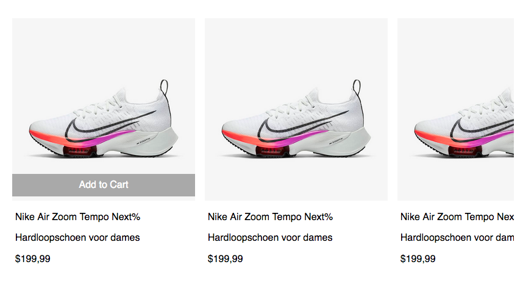
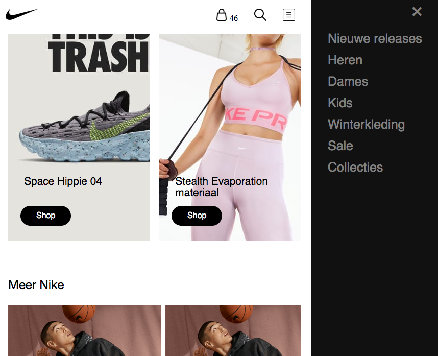
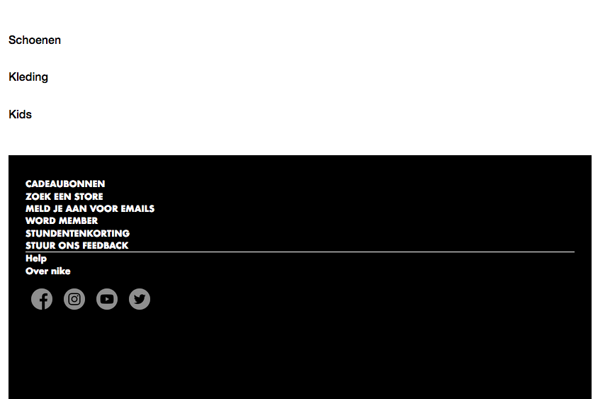
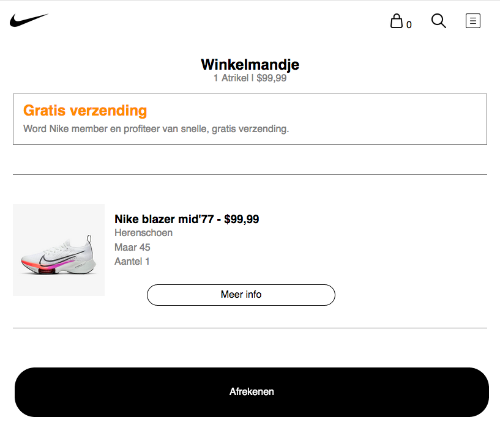

## Voortgang 3 (week 6)
Deze week heb ik gewerkt aan mijn tweede pagina.
Ook probeer ik nu om een geheel werkende shopping cart te hebben. Dit is alleen vrij lastig,
aangezien je hiervoor een localstorage moet maken.

## Voortgang 2 (week 5)

### Stand van zaken

Ik heb nu mijn eerste pagina van mijn site zo goed als af. Ik heb de hele pagina responsive gemaakt en alle content aan het geheel toegevoegd.
Ook ben ik bezig geweest met mijn eerste micro animatie.

**Screenshot(s):**

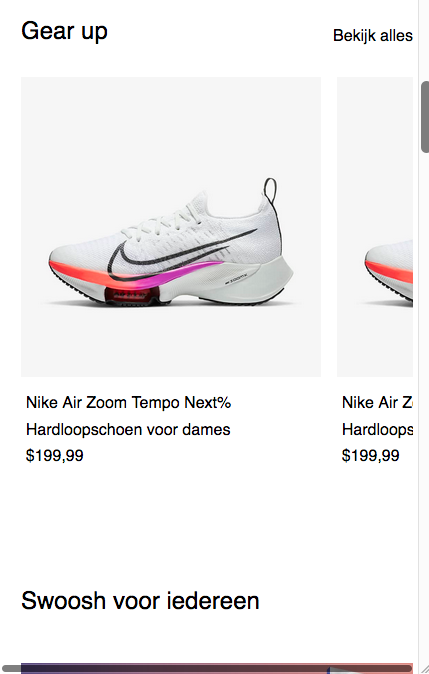
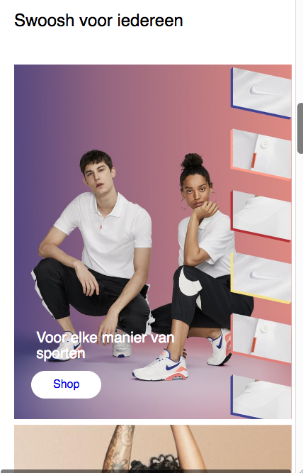
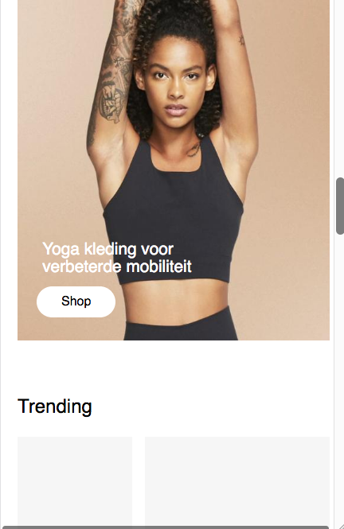
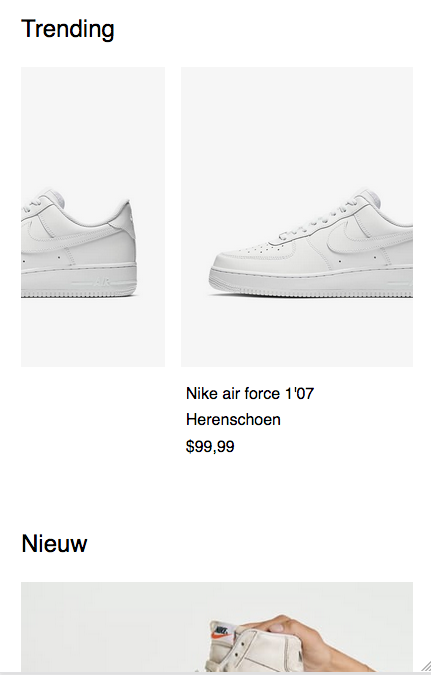
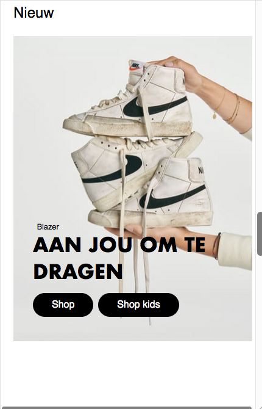
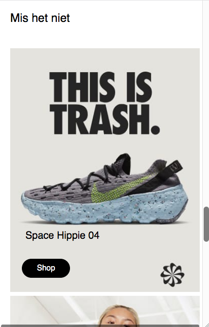
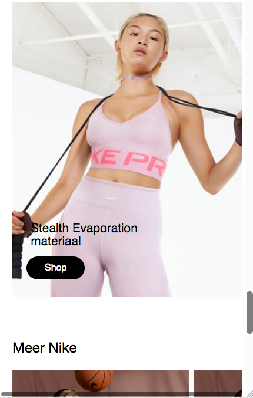
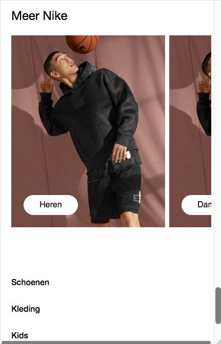
=======

Agenda vragen

1. javascript slider (nesli)
2. vraag over de propertie; position fixed & automatische transities van afbeeldingen (stijn)
3. border menu vraag (nesli

## Voortgang 1 (week 3)

### Stand van zaken

- De huiswerkopdrachten gingen zeer goed, alleen had ik nog wel moeite met javascript. Dit blijf ik altijd wel lastig vinden.-

**Screenshot(s):**

<<<<<<< HEAD

=======

>>>>>>> 5537bd6f590d51af3c2c88d9cdc4b59b7c63b0af

### Agenda voor meeting

-geen vragen.-

### Verslag van meeting

-na afloop snel uitkomsten vastleggen-

## Intake (week 1)

**Je startniveau:** -blauw-

**Je focus:** -responsive-

**Je opdracht:** - https://www.nike.com/nl/

**Screenshot(s):**

>>>>>>> 5537bd6f590d51af3c2c88d9cdc4b59b7c63b0af

**Breakdown-schets(en):**

