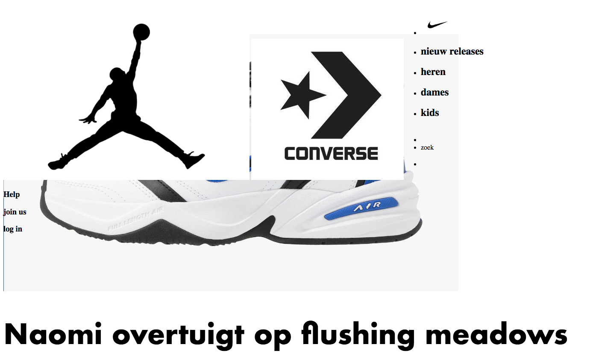
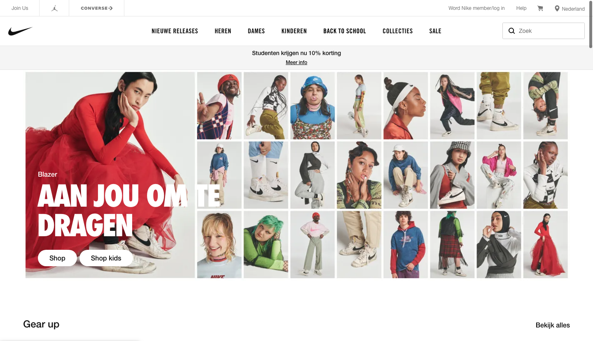
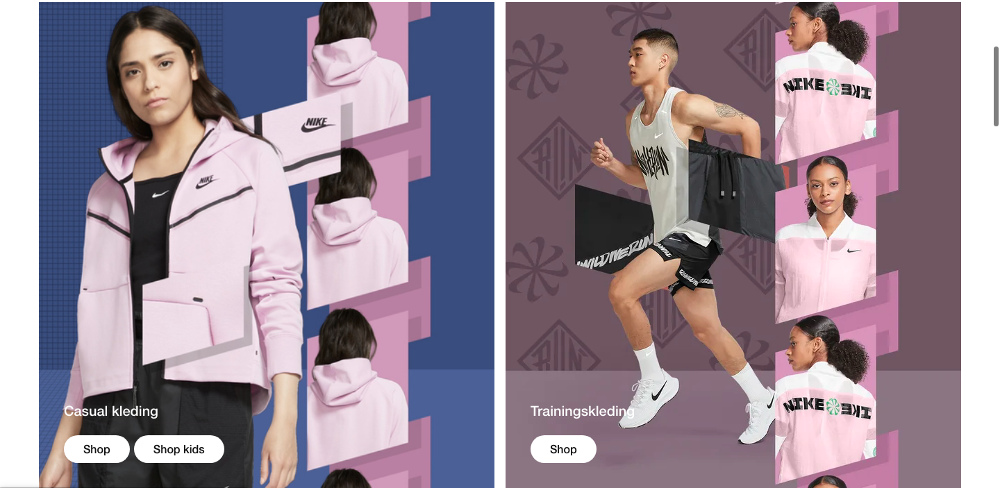
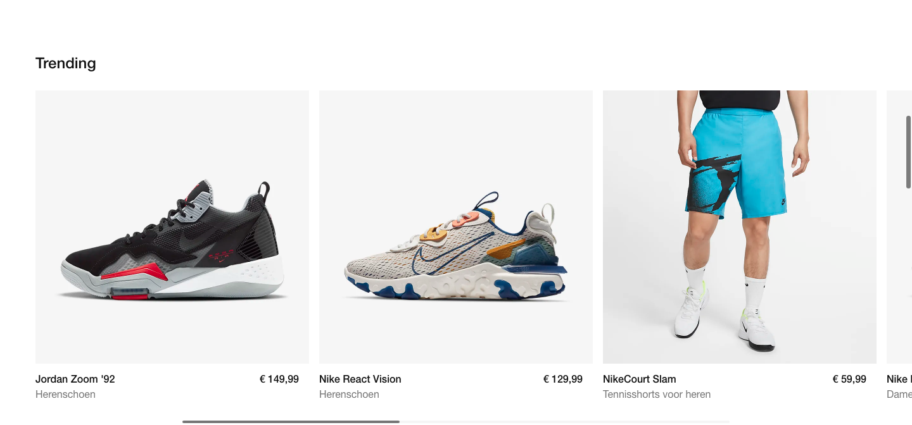
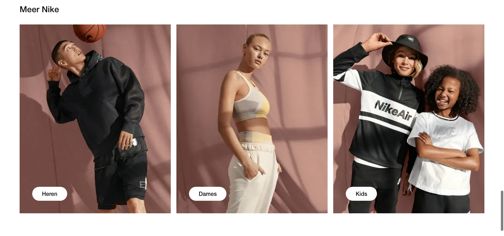
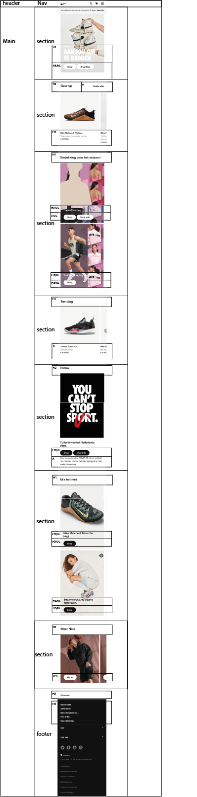

# Procesverslag
**Auteur:** -jouw naam-

Markdown cheat cheet: [Hulp bij het schrijven van Markdown](https://github.com/adam-p/markdown-here/wiki/Markdown-Cheatsheet). Nb. de standaardstructuur en de spartaanse opmaak zijn helemaal prima. Het gaat om de inhoud van je procesverslag. Besteedt de tijd voor pracht en praal aan je website.

## Bronnenlijst
1. -bron 1-
2. -bron 2-
3. -...-

## Eindgesprek (week 7/8)

-dit ging goed & dit was lastig-

**Screenshot(s):**

-screenshot(s) van je eindresultaat-

## Voortgang 3 (week 6)

-same as voortgang 1-

## Voortgang 2 (week 5)

-same as voortgang 1-

## Voortgang 1 (week 3)

### Stand van zaken

- De huiswerkopdrachten gingen zeer goed, alleen had ik nog wel moeite met javascript. Dit blijf ik altijd wel lastig vinden.-

**Screenshot(s):**

<<<<<<< HEAD

=======

>>>>>>> 5537bd6f590d51af3c2c88d9cdc4b59b7c63b0af

### Agenda voor meeting

-geen vragen.-

### Verslag van meeting

-na afloop snel uitkomsten vastleggen-

## Intake (week 1)

**Je startniveau:** -blauw-

**Je focus:** -responsive-

**Je opdracht:** -link naar de website die je gaat namaken óf de naam van je eigen ontwerp-

**Screenshot(s):**
<<<<<<< HEAD

=======

>>>>>>> 5537bd6f590d51af3c2c88d9cdc4b59b7c63b0af

**Breakdown-schets(en):**

